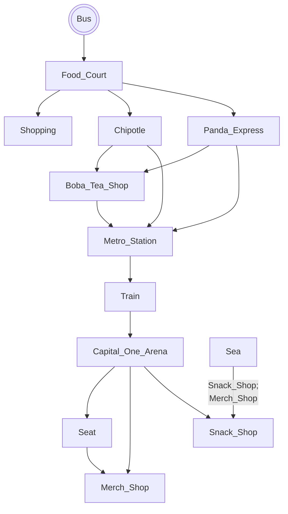

# Wizards Game!

# Setting

This game takes place at the Pentagon city mall and the Capital One Arena.
Scattered along are a metro station, and come places to get some food before
the game. The player will start by exiting a bus at pentagon city mall.

## Map

The player starts on the bus, and is then directed to the Food Court. they can
explore, but they must eventually make their way to their seat before tip off.
